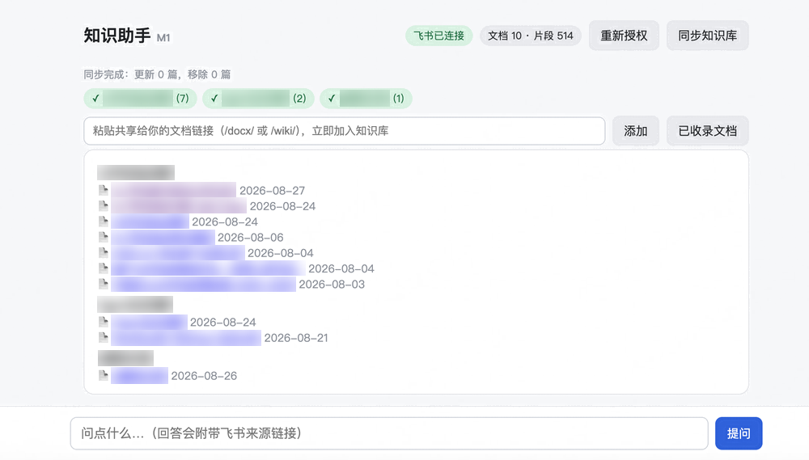

# 知识助手

**把飞书知识库变成一个能问的助手。** 提问后直接给答案，每条依据都带飞书原文链接——点一下序号就跳到那一行，可以直接贴进你的材料里。

索引全在自己的 Mac 上，只索引你在飞书里本来就有权限看的文档。



## 它解决什么

知识库越攒越大之后，真正的成本不是没有资料，而是**知道资料在里面、但找不到是哪一篇的哪一行**。

- **查证快一步**：「某竞品的这个功能什么时候上的」——不用翻十几篇文档，问一句，答案带原文定位。
- **汇报前找出处**：要一个数字、一句结论的来源，点序号跳到原文那行，截图或引用都有据可依。
- **不用当人肉索引**：把飞书机器人拉进群，同事自己 @ 它问，答案同样带来源。
- **知识库没有的也不空手**：置信度不够时可选联网兜底，并明确标注是网页来源。

设计前提只有一条：**飞书知识库是唯一事实源，这个工具只是它的检索层。** 语料质量在飞书里维护，工具不做二次编辑。

## 两个入口

**网页界面**（上图）：本机 `http://127.0.0.1:8787`。按项目筛选、粘链接即时入库、查看已收录文档清单。

**飞书机器人**（下图）：单聊直接问，群里 @ 它问。回答结构固定为「结论 / 依据 / 来源」，来源里每个 `[n]` 都是独立的定位链接。


> 两张图里的文档名已做模糊处理，实际显示的是你自己知识库里的真实标题。

## 上手三步

### 第 1 步 · 在飞书后台建一个应用（约 10 分钟，只做一次）

打开 [飞书开发者后台](https://open.feishu.cn/app)，创建**企业自建应用**，然后：

1. **凭证与基础信息** —— 记下 `App ID`（`cli_` 开头）和 `App Secret`，第 2 步要填。
2. **权限管理 → API 权限** —— 搜索权限码逐个开通：

   | 权限码 | 作用 |
   |---|---|
   | `docx:document:readonly` | 读新版文档 |
   | `wiki:wiki:readonly` | 读知识库目录结构 |
   | `drive:drive:readonly` | 遍历文档列表 |
   | `bitable:app:readonly` | 读多维表格 |
   | `sheets:spreadsheet:readonly` | 读电子表格 |
   | `offline_access` | 免每天重新登录 |

3. **安全设置 → 重定向 URL** —— 添加 `http://127.0.0.1:8787/callback`（授权完要跳回本机，这行不填会报错）。
4. **要用机器人的话**：在「应用能力」里添加**机器人**；权限再加 `im:message`、`im:message.group_at_msg:readonly`（群里 @ 它）、`im:message.p2p_msg:readonly`（单聊）；「事件订阅」的订阅方式选**长连接**，添加事件 `im.message.receive_v1`。选长连接就不需要公网服务器。
5. **版本管理与发布** —— 创建版本并发布，等管理员通过。

> ⚠️ 最容易踩的坑：**改了权限必须重新发布一个版本才生效**，并且要回到网页里重新点一次「连接飞书」。后面遇到「授权报 20027」基本都是这个原因。

### 第 2 步 · 装到 Mac 上，填三个空

```bash
git clone https://github.com/YujiHuang/feishu-knowledge-assistant.git ~/knowledge-assistant
cd ~/knowledge-assistant
python3 -m venv .venv && ./.venv/bin/pip install -r requirements.txt
cp config.example.yaml config.yaml
open -e config.yaml          # 用「文本编辑」打开，改完存盘
```

`config.yaml` 里只有三处必填：

| 改哪一行 | 填什么 | 从哪儿抄 |
|---|---|---|
| `feishu.app_id` | `cli_` 开头那串 | 第 1 步的「凭证与基础信息」 |
| `feishu.app_secret` | 一串 32 位字符 | 同上 |
| `sync.wiki_space_allowlist` | 知识库的 space_id | 浏览器打开你的知识库，地址里 `/wiki/space/` 后面那串数字 |

**大模型的 key 不要填在这里**，`llm.api_key` 保持留空。第一次启动时终端会问你，粘进去之后可以选择存入 macOS 钥匙串，以后就不用再输。这样 key 不落到任何文件里，也不会被 git 带走。默认走 DeepSeek 官方接口，换任何 OpenAI 兼容的网关只需改 `llm.base_url` 和 `llm.model`。

想开联网兜底的话，再去 [Tavily](https://tavily.com) 拿一个免费 key 填到 `web_search.api_key`；不填就只查知识库。

### 第 3 步 · 启动，授权，同步

```bash
cd ~/knowledge-assistant && ./start.sh
```

浏览器打开 **http://127.0.0.1:8787**，然后：点「连接飞书」完成授权 → 点「同步知识库」。

首次同步按文档量可能要几十分钟（飞书接口限速每秒 4 次），页面上有进度，放着不管就行。同步途中大量出现 `1770032` 是正常的——那是遇到了你没有阅读权限的文档，自动跳过。同步完就能提问了。

## 日常使用

```bash
# 主服务（网页问答）
cd ~/knowledge-assistant && ./start.sh

# 飞书机器人（可选，另开一个终端标签页，需要主服务已在跑）
cd ~/knowledge-assistant && ./start.sh bot
```

停止：各自的窗口里 Ctrl-C。想确认在跑：`pgrep -fl "app.main|app.bot"`。

索引是持久化的，重启不用重新同步；默认每 60 分钟自动同步一次，改了飞书文档想立刻生效就手动点一次「同步知识库」。机器人只在你的 Mac 开着、两个进程都在跑的时候在线。

## 边界与安全

**能读**：新版文档（docx，含内嵌的表格）、多维表格、电子表格。**读不了**：旧版文档、思维笔记、文件附件里的内容。

**数据在哪**：索引、飞书凭证、同步状态都在本机 `~/.knowledge-assistant/`，不上传。只有提问的那一刻，检索到的文档片段会随问题发给大模型。

**权限边界**：同步走你的个人授权，读不到你本来看不到的文档。

**机器人是唯一的例外，值得单独想一下**：它的回答文本本身就是文档内容的提炼，同事即使点不开来源链接，也能从答案里看到要点——链接鉴权在这里是防不住的。所以请用 `config.yaml` 的 `bot.projects` 白名单，把机器人能检索的范围限定在「愿意让同事问到」的那几个目录，留空等于全部开放。

## 更多

配置项全表、引用定位的实现原理、回归测试、故障排查对照表 → **[docs/技术说明.md](docs/技术说明.md)**

自用工具，没有打包成 App，也没做多用户。技术栈：FastAPI + LanceDB + bge-small-zh（本地 embedding）+ BM25/向量混合检索 + 任意 OpenAI 兼容大模型。
